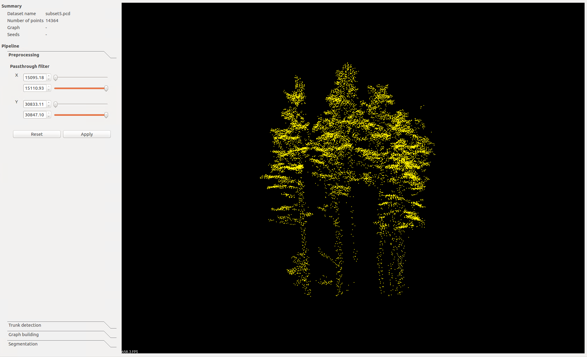
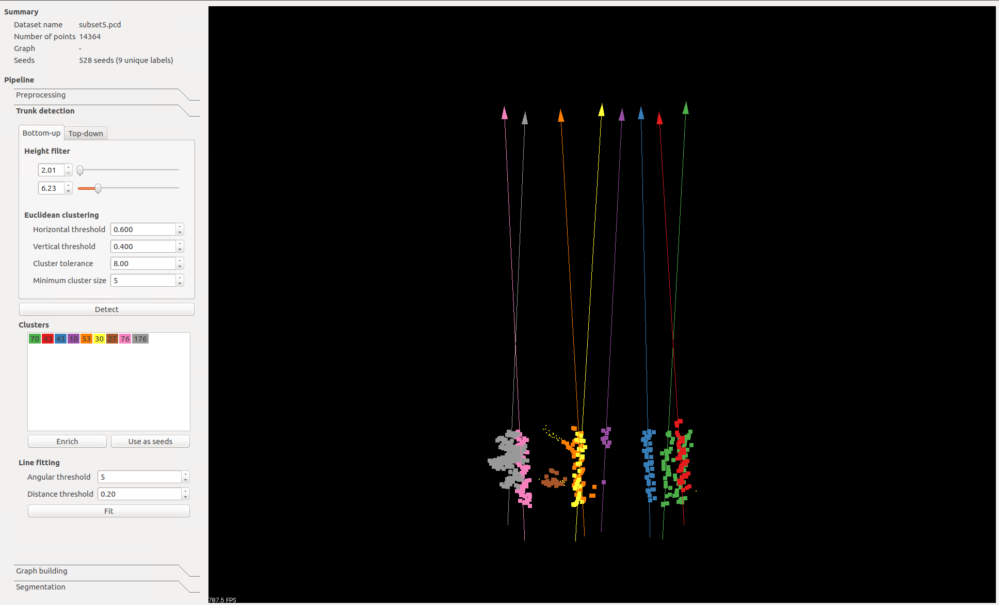
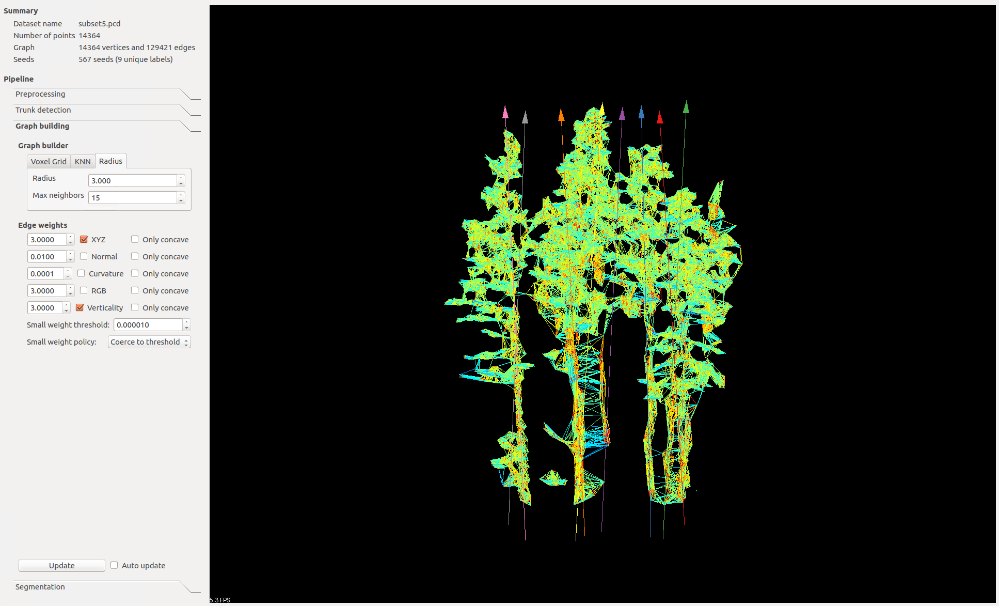
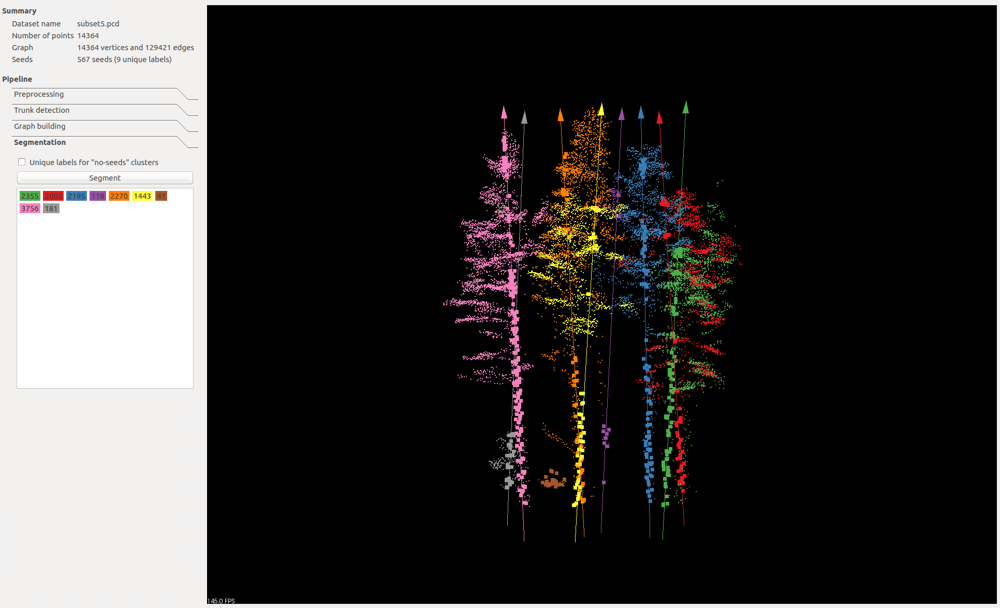

Description
===========
Individual tree segmentation of LiDAR-derived point clouds implemented using [The Point Cloud Library (PCL)](http://pointclouds.org/) and described in:
[Shendryk, I., M. Broich, M. G. Tulbure and S. V. Alexandrov (2016). "Bottom-up delineation of individual trees from full-waveform airborne laser scans in a structurally complex eucalypt forest." Remote Sensing of Environment 173: 69-83.](https://www.sciencedirect.com/science/article/pii/S0034425715301966)

and applied in:

[Shendryk, I., M. Broich, M. G. Tulbure, A. McGrath, D. Keith and S. V. Alexandrov (2016). "Mapping individual tree health using full-waveform airborne laser scans and imaging spectroscopy: A case study for a floodplain eucalypt forest." Remote Sensing of Environment 187: 202-217.](https://www.sciencedirect.com/science/article/pii/S0034425716303868)

[Shendryk, I., M. Broich and M. G. Tulbure (2018). "Multi-sensor airborne and satellite data for upscaling tree number information in a structurally complex eucalypt forest." International Journal of Applied Earth Observation and Geoinformation 73: 397-406.](https://www.sciencedirect.com/science/article/pii/S0303243418303155)

Acknowledgements
================
This work exists thanks to:
1) [Mirela Tulbure](https://scholar.google.com/citations?user=NHDv_PoAAAAJ&hl=en) 
2) [Mark Broich](https://scholar.google.com/citations?user=D2t2HsQAAAAJ&hl=en)
3) [Sergey Alexandrov](https://scholar.google.com/citations?user=uIZq6XsAAAAJ&hl=en)

Installation
============

1. Install universal pre-requisites (Ubuntu 16.04):

```bash
 sudo apt-get update
 sudo apt-get install git build-essential linux-libc-dev
 sudo apt-get install cmake cmake-gui 
 sudo apt-get install libeigen3-dev
 sudo apt-get install libboost-all-dev
 sudo apt-get install libflann-dev
 sudo apt-get install libvtk6-qt-dev
 sudo apt-get install libqhull-dev
 sudo apt-get install libproj-dev 

```

2. Install PCL v1.8.1 (Ubuntu 16.04):

```bash
wget https://github.com/PointCloudLibrary/pcl/archive/pcl-1.8.1.tar.gz
tar -xf pcl-1.8.1.tar.gz
cd pcl-pcl-1.8.1 && mkdir build && cd build
cmake ..
make
sudo make install
```

3. Clone this repository (recursively) and make out-of-source build:

```bash
git clone --recursive https://github.com/yurithefury/ForestMetrics.git ForestMetrics
cd ForestMetrics
mkdir build
cd build
cmake ..
make
```

Data
====

There are examples of LiDAR scenes in .pcd format in the 'data/' folder. 
Use [las2pcd](https://github.com/murtiad/las2pcd) to convert .las to .pcd format.

Usage
=====

Navigate to the 'data/' folder and run

    cd ForestMetrics/data/
    ../bin/gui_delineation subset8.pcd

The program will load given file and present a pipeline for individual tree segmentation. 
To zoom in press `r`. 

Visualizer interface
--------------------

This is the standard PCL visualizer with several extensions. It has a list of
objects available for visualization. To see it press `h`. The list will contain
status indicators, short descriptions, and keys that are used to toggle display
of the objects. For the random walker segmentation app it may look as follows:

                       Visualization objects
    ─────┬╌╌╌╌╌╌╌╌╌╌╌╌╌╌╌╌╌╌╌╌╌╌╌╌╌╌╌╌╌╌╌╌╌╌╌╌╌╌╌╌╌╌╌╌╌╌╌╌┬──────
      ☐  │ Display vertices                          │ V
      ☐  │ Display edges                             │ E
      ☐  │ Dispaly seeds                             │ S
      ☐  │ Dispaly points                            │ P
      ☐  │ Dispaly lines                             │ L
      ☒  │ Display trees                             │ T
    ─────┴╌╌╌╌╌╌╌╌╌╌╌╌╌╌╌╌╌╌╌╌╌╌╌╌╌╌╌╌╌╌╌╌╌╌╌╌╌╌╌╌╌╌╌╌╌╌╌╌┴──────

For example, press `a` to toggle graph adjacency edges display.

Pipeline:
---------
The pipeline consists of four steps: 
1) Preprocessing 
2) Trunk (or tree top) detection 
3) Graph building 
4) Segmentation using a random walker algorithm

Preprocessing
--------------

In this step use a [pass through filter](http://pointclouds.org/documentation/tutorials/passthrough.php) to define points for further processing based on `X` and `Y` bounds.
Basically, if your area of interest is too big you can cut out a snippet for evaluation.



Trunk (or tree top) detection
------------------------------

In this step you can either define your seeds for random walker segmentation as trunks 
(for bottom-up segmentation) or tree tops (for top-down segmentation). I suggest using
 bottom-up segmentation only if the density of your LiDAR point clouds is >20 points/m^2.
 
Seed selection works as follows:
1. Bottom-up:
    
    1.1. Use another [pass through filter](http://pointclouds.org/documentation/tutorials/passthrough.php)
     to define points for tree trunk detection between `Zmin` and `Zmax` height.
    
    2.2. Use [conditional euclidean clustering](http://pointclouds.org/documentation/tutorials/conditional_euclidean_clustering.php)
     to segment individual tree trunks (i.e. seeds). You will have to adjust `horizontal threshold`, 
     `vertical threshold`, `cluster tolerance` and `minimum cluster size`.
     
    3.3. Use [3D line fitting](http://pointclouds.org/documentation/tutorials/random_sample_consensus.php)
     to 'enrich' seeds along the tree trunk. You will have to adjust `angular threshold` 
     and `distance threshold` parameters. When you are done with adjusting the parameters press `enrich` button
     to add points to existing trunks.
     
    
2. Top-down:
    
    2.1. Use tree top detection using [local maxima](https://github.com/PointCloudLibrary/pcl/blob/master/filters/include/pcl/filters/local_maximum.h)
     algorithm. You will have to adjust `radius` parameter.

When you are done with adjusting the parameters press `use as seeds` button. Press press `r` and 

Graph building
---------------

Here you can build your 3D graph for random walker segmentation. As part of this procedure you will
have to define `Graph builder` and `Edge weights` parameters.

1. Graph builder:
    
    1.1. Use `Voxel grid` to define the voxel resolution
    
    1.2. Use `KNN` to define k-nearest neighbors
    
    1.3. Use `Radius` to define the radius and maximum nearest neighbours
    
2. Edge weights:
 
   Here you will have to adjust  `XYZ`, `Normal`, `Curvature`, `RGB` and `Verticality` parameters.
   
 When you are done with adjusting the parameters press `Update`. Press `E` button to display 
 the edges of the graph.
 


Segmentation
-------------
After the seeds are defined and the graph is built press `Segment` button to perform 
random walker segmentation and visualize the results. Go to `File` &rarr; `Save segmentation` 
to write your segmentation results to a .pcd file. 
